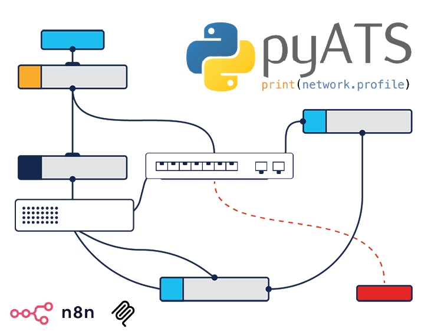

<h1 align="center">pyATS 🫰 AgenticOps<br /><br />
<div align="center">

</div>

<div align="center">


<a href="https://deepwiki.com/ponchotitlan/pyATS-loves-agenticops"></a>
</div>
</h1>

<div align="center">
A collection of <strong>low-code</strong>, AgenticOps workflows based on <strong>n8n, MCP and Cisco pyATS</strong> for some nice Network Automation experiments 🧪
<br /><br />
</div>

---

## 📦 Included projects

### ⚙️ 1. ChatOps Agentic Network Automation
Operate your network directly from Slack using a multi-agent architecture.

**Highlights**
- 💬 Slack-based ChatOps interface  
- 🧠 Multiple specialized agents (intent, planning, read, commit, formatting)  
- 🛡️ Guardrails with human approval before writes  
- 🔌 Real execution via **pyATS MCP**  
- 🔁 Rollback-aware configuration workflows  

**Use cases**
- Safe interactive automation  
- Change workflows with approval  
- Secure self-hosted NetOps bots  


📁 More information:  
[Agentic ChatOps for network automation using n8n + Slack + pyATS MCP](https://github.com/ponchotitlan/pyATS-loves-agenticops/blob/main/docs/chatops_workflow.md)

---

### 📊 2. Agentic Reporting & Automated Ticketing
An autonomous pipeline for **continuous network reporting and GitHub-native remediation tracking**.

**Highlights**
- 📅 Scheduled or manual execution  
- 🤖 Reporting agent investigates network using **pyATS MCP**  
- 📄 Generates professional Markdown reports  
- 📁 Commits reports to GitHub  
- 🎫 Ticketing agent detects risks and auto-creates GitHub Issues  
- 🔗 Tight traceability between evidence and action  

**Use cases**
- Continuous posture reporting  
- Compliance evidence  
- Risk-driven backlog generation  
- GitOps-style operational governance  

📁 More information:  
[Agentic reporting + GitHub issue automation using n8n + pyATS MCP](https://github.com/ponchotitlan/pyATS-loves-agenticops/blob/main/docs/reporting_ticketing_workflow.md)

---

## ⚙️ General setup

Clone the pyATS MCP repository:

```
git clone https://github.com/ponchotitlan/pyATS_MCP
```

Follow the instructions in the README of this repository to setup the MCP server in **HTTP mode**. Afterwards, clone this repository:

```
git clone https://github.com/ponchotitlan/pyATS-loves-agenticops
```

Open the `docker-compose.yml` file and update the following parameters of the services:

```
# Webhook URL - Get your static domain from https://dashboard.ngrok.com/cloud-edge/domains
# Then replace YOUR-STATIC-DOMAIN below with it (e.g., abc-123-def.ngrok-free.app)
- WEBHOOK_URL=uYOUR-STATIC-DOMAIN

ngrok:
. . .
- "--domain=YOUR-STATIC-DOMAIN"

# Get your auth token from https://dashboard.ngrok.com/get-started/your-authtoken
- NGROK_AUTHTOKEN=YOUR-TOKEN
```

Execute the following command to create a ngrok and n8n pair of containers:

```
docker compose up -d
```

To stop the services, issue the following command:

```
docker compose down
```

---

## 🧠 Architectural philosophy

| Principle | Meaning |
|--------|--------|
| 🧩 Separation of concerns | No agent has unlimited power |
| 🔒 Guardrails by design | Writes require structure + approval |
| 🔧 Tools over hallucinations | Real data via pyATS MCP |
| 📁 Git as source of truth | Prompts, reports, tickets are versioned |
| 👤 Humans stay in control | Automation proposes, humans approve |

> Assume models are fallible. Design systems that remain safe anyway.

---

## 🔌 Core execution layer: pyATS MCP

Both projects rely on a shared real-world execution backend:

👉 [pyATS MCP](https://github.com/ponchotitlan/pyATS_MCP)

This provides:
- Real CLI execution  
- Real device outputs  
- Zero fabricated telemetry  
- Clean separation between reasoning and execution  

---

## 🧰 Core stack

- **pyATS** – network interaction engine  
- **MCP server** – execution abstraction  
- **n8n** – workflow orchestration  
- **LLM agents** – reasoning layer  
- **GitHub** – storage, audit trail, collaboration  
- **Slack** – ChatOps interface (project 1)  

---

## 🏗️ What this is good for

- Agentic NetOps experimentation  
- Secure automation architecture  
- Internal platform foundations  
- Operational AI
- GitOps + AI convergence   

---

## 🤝 Contributing

Got ideas for new workflows or improvements? Contributions are welcome! Feel free to open issues or submit pull requests.

---

## 🌐 Resources

- [Cisco pyATS Documentation](https://developer.cisco.com/docs/pyats/)
- [n8n Documentation](https://docs.n8n.io/)
- [Model Context Protocol](https://modelcontextprotocol.io/)

---

<div align="center"><br />
    Made with ☕️ by Poncho Sandoval - <code>Developer Advocate 🥑 @ DevNet - Cisco Systems 🇵🇹</code><br /><br />
    <a href="mailto:alfsando@cisco.com?subject=Question%20about%20[pyATS%20loves%20AgenticOps]&body=Hello,%0A%0AI%20have%20a%20question%20regarding%20your%20project.%0A%0AThanks!">
        
    </a>
    <a href="https://github.com/ponchotitlan/pyATS-loves-agenticops/issues/new">
      
    </a>
    <a href="https://github.com/ponchotitlan/pyATS-loves-agenticops/fork">
      
    </a>
</div>
