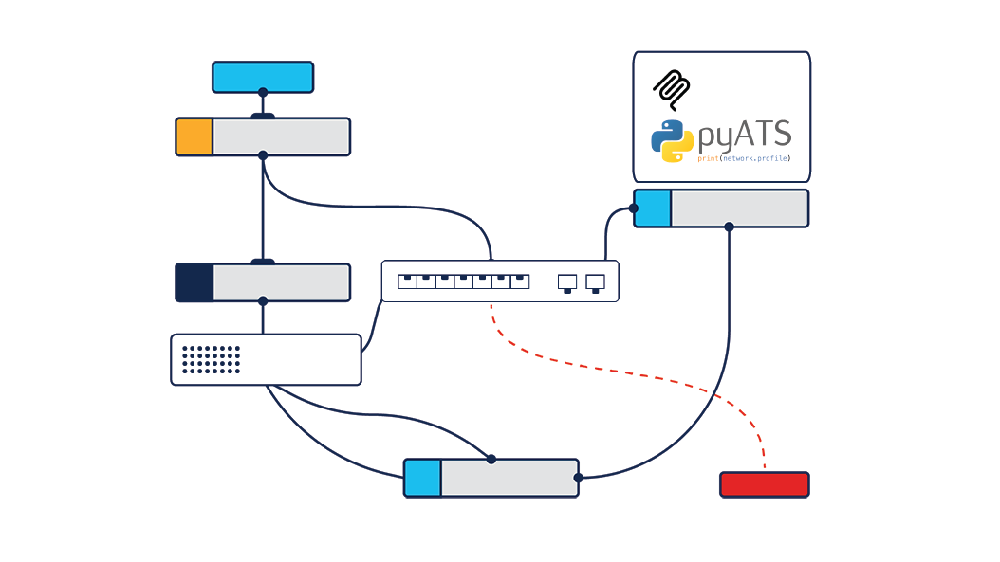

<h1 align="center">pyATS 🫰 AgenticOps  

</h1>

A collection of <strong>low-code</strong>, AgenticOps workflows based on <strong>n8n, MCP and Cisco pyATS</strong> for network automation experiments across AI use cases 🧪
  

---

## ✅ Prerequisites

Before diving in, make sure you have these essentials ready:

- 🐳 **Docker**: For containerized workflow execution
- 🐍 **Python 3.10+**: Required for MCP server operations
- 🔑 **Anthropic API key**: Required by the AI agent nodes in the ChatOps workflow
- 💬 **Slack workspace + Slack app**: Required for bot mentions and interactive approvals
- 🌐 **Public HTTPS URL for n8n webhooks**: Cloudflare Tunnel token + domain (or ngrok equivalent)

---

## 🚦 Getting Started

1. **Clone this repository** to your local machine
2. **Adjust `testbed.yaml`** with your own network inventory and credentials
3. **Explore the workflow folders**: Each folder contains:
   - 📚 Dedicated documentation in `.md` files explaining setup and usage
   - 📄 A `.json` workflow file ready to import into n8n

Each workflow is self-contained with its own configuration and detailed instructions. Simply pick the one that fits your use case and follow along! 🎓

---

## 📦 Available Workflows

| Workflow Name | Description |
|---------------|-------------|
| 🛡️ **[Slack ChatOps for my network](./n8n/Slack%20ChatOps%20for%20my%20network/)** | Enhanced ChatOps via Slack that include guardrails, human-in-the-loop for config commits, conflict detection and much more |
| 📊 **[Reporting and Auditing for my network](./n8n/Reporting%20and%20Auditing%20for%20my%20network/)** | Automated triggering of audits based on GitHub files to create reports and issues in GitHub based on the findings |

---

## 🤝 Contributing

Got ideas for new workflows or improvements? Contributions are welcome! Feel free to open issues or submit pull requests.

---

## 🌐 Resources

- [Cisco pyATS Documentation](https://developer.cisco.com/docs/pyats/)
- [n8n Documentation](https://docs.n8n.io/)
- [Model Context Protocol](https://modelcontextprotocol.io/)

---

 
    Made with ☕️ by Poncho Sandoval - <code>Developer Advocate 🥑 @ DevNet - Cisco Systems 🇵🇹</code>  
    
    
    

