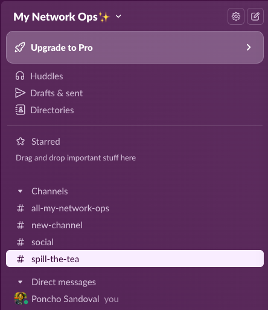
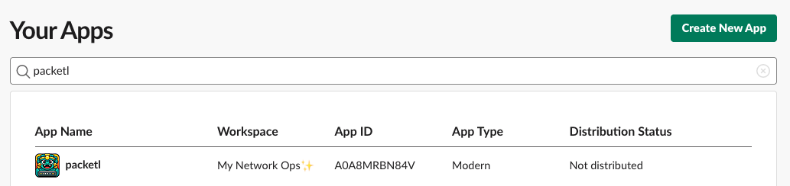
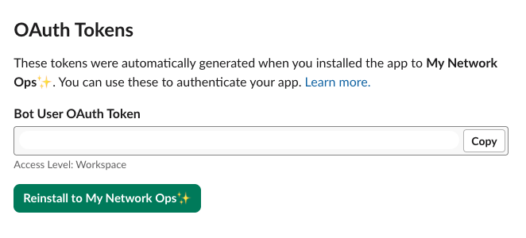
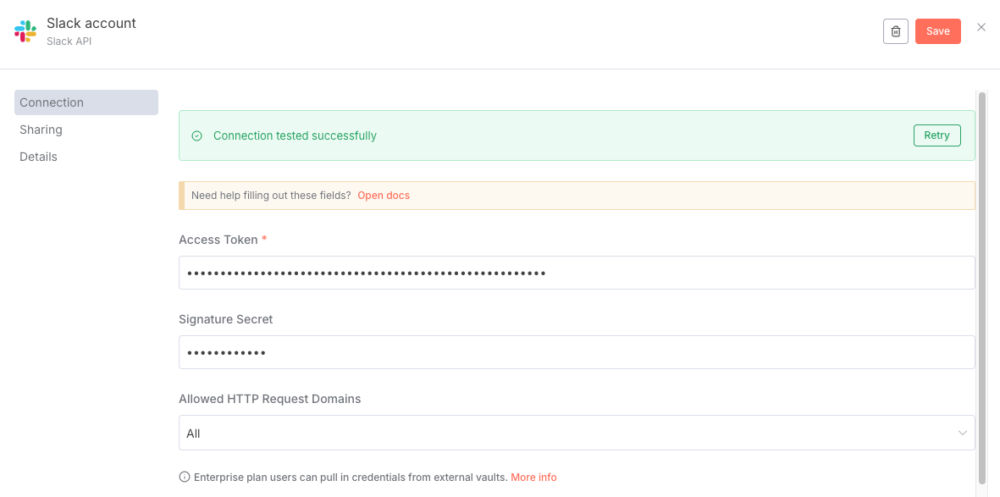
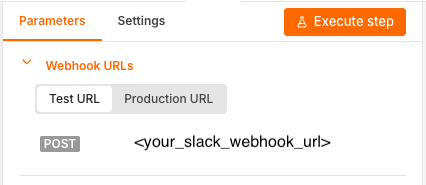
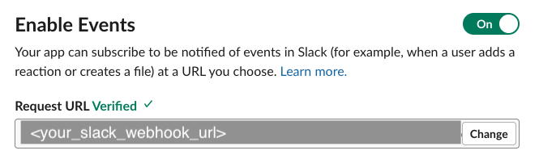
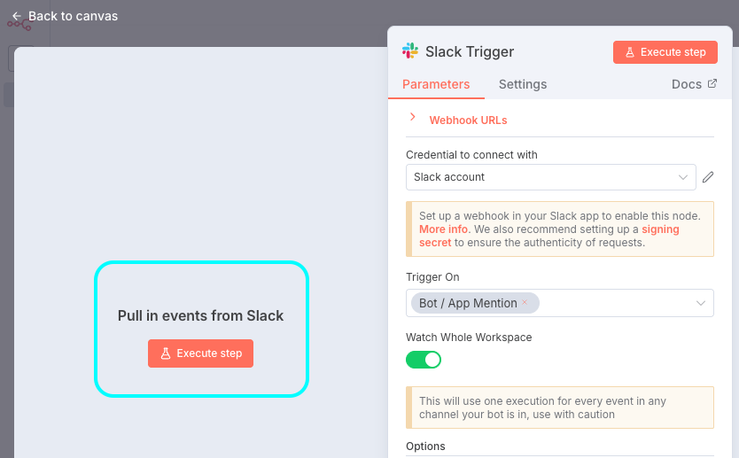
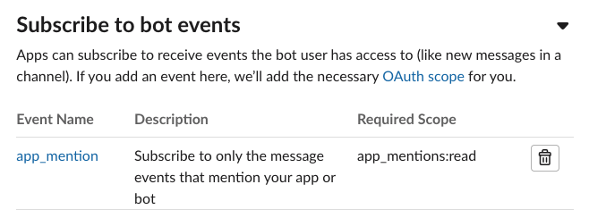
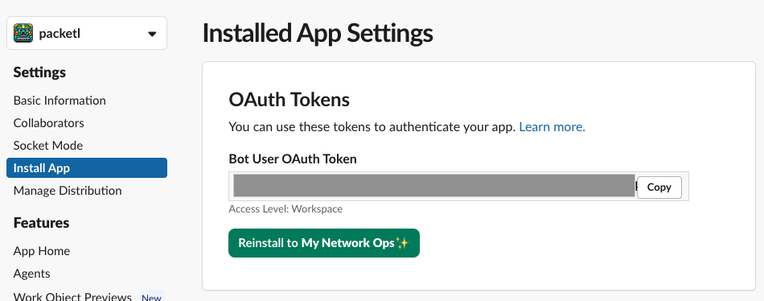
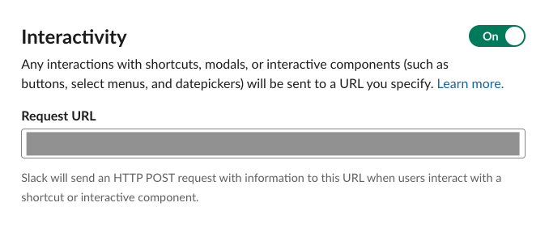

# ⚙️ Slack setup for n8n workflows

This document describes how to set up your Slack system for interacting with the Multi-Channel ChatOps n8n workflow in this repository.</br>
**Buckle up!**

## Before you start

- Ensure your n8n URL is publicly reachable over HTTPS (Cloudflare Tunnel, ngrok, or equivalent).
- Ensure your workflow is imported in n8n and both webhook nodes are visible:
	- `When your Slack bot is mentioned` (Slack Trigger)
	- `When a Card is Clicked` (Webhook for interactive button actions)
- Keep your workflow open in n8n while configuring URLs in Slack.

1. Create a Workspace in your Slack. In this case, we will use ```My Network Ops✨```

</br>
<div align="center">

</div>
</br>

2. Create Slack App at `api.slack.com/apps` in the Workspace aforementioned:

</br>
<div align="center">

</div>
</br>

3. Navigate to `OAuth & Permissions` and add the following `Bot Token Scopes`:
- `app_mentions:read`
- `channels:history`
- `channels:read`
- `chat:write`
- `chat:write.public` (optional but useful if your bot posts to public channels before being invited)
- `groups:history`
- `groups:read`
- `im:history`
- `im:read`
- `im:write`

4. Also in `OAuth & Permissions`, scroll to `OAuth Tokens` and generate a new token. Take note of this token as we will need it later.

</br>
<div align="center">

</div>
</br>

5. Click the button `Reinstall to <your_room_name>` to activate this token.

6. In your n8n workflow, open the `Slack Trigger` block. Select `Credential` and add a new credential. In the `Access Token` field, put the OAuth token generated in step no.4. and test the connection.

</br>
<div align="center">

</div>
</br>

> ⚠️ If the connection is unsuccessful, try with deleting the parameter `Signature Secret`. It will populate automatically once the connection is established.

7. Back in your `Slack Trigger` block, open the drop-down option of `Webhook URLs`. Depending on the following, you will copy one or the other URL:

- If your n8n workflow is in **test mode**, copy the `Test URL` part
- If your n8n workflow is **active**, copy the `Production URL` part

</br>
<div align="center">

</div>
</br>

8. Go back to your app in `api.slack.com/apps`. Navigate to `Enable Event Subscriptions` > `Enable Events` > `Request URL` and provide the URL from the previous step.

</br>
<div align="center">

</div>
</br>

> ⚠️ If you are using your n8n in **Test mode**, you need to click `Execute step` in your `Slack Trigger` **before** adding the webhook URL in the Slack Request URL field. Otherwise, the request will fail! You don't need to do this if your n8n workflow is **active**.

</br>
<div align="center">

</div>
</br>

9. In the same page, scroll to `Subscribe to bot events`. Add the event `app_mention`. Afterwards, click on `Save Changes`.

</br>
<div align="center">

</div>
</br>

10. Navigate to `Settings` > `Install App` and click again `Reinstall to <your_room_name>`.

</br>
<div align="center">

</div>
</br>

11. In your n8n workflow, open the node `When a Card is Clicked` and copy the webhook URL:

- Use `Test URL` if your workflow is in test mode and you are executing that node.
- Use `Production URL` if your workflow is active.

</br>
<div align="center">

</div>
</br>

12. Back in `api.slack.com/apps`, go to `Interactivity & Shortcuts` and enable `Interactivity`.
13. Paste the URL from step 11 into the field `Request URL` and save:

</br>
<div align="center">

</div>
</br>

> ⚠️ If Slack cannot validate the interactivity URL in test mode, execute `When a Card is Clicked` first in n8n and retry.

**Ready to test!** Create a new channel in your workspace, add your app and tag it to ask any question about your network!

</br>
<div align="center">

</div>
</br>