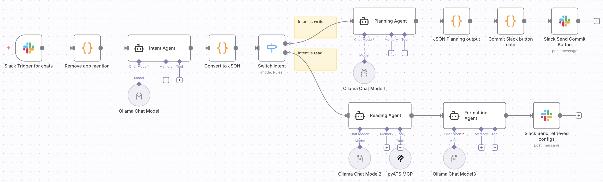
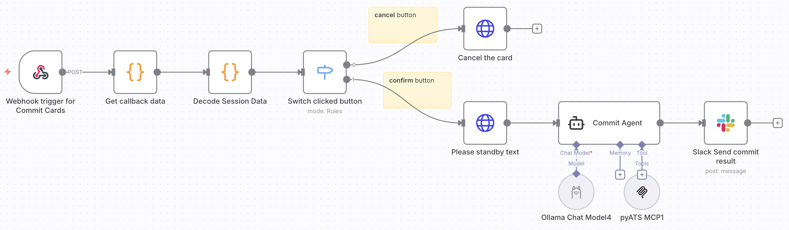
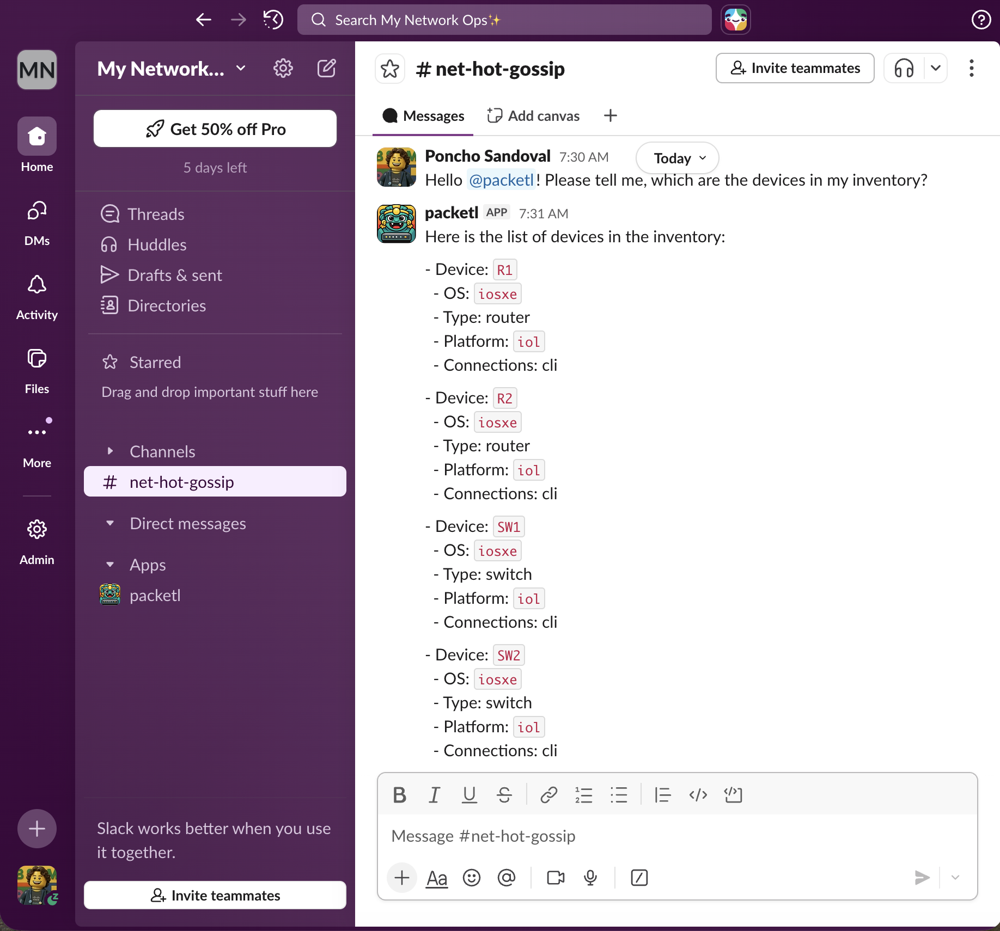
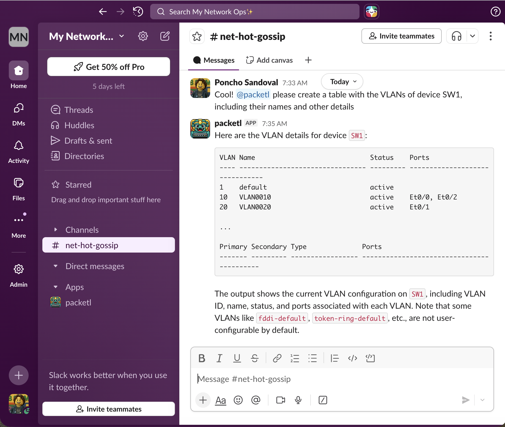

# ⚙️ ChatOps Agentic Network Automation Workflow (n8n + Slack)

A practical **low-code, agentic ChatOps workflow** built in **n8n** for safe network automation via **Slack**.  
Uses **multiple specialized agents**, structured guardrails, and real device interaction through **pyATS MCP**.

[🔗 Link to n8n workflow file](https://github.com/ponchotitlan/pyATS-loves-agenticops/blob/main/workflows/ChatOps%20Network%20Automation%20Workflow.json)

---

## ✨ What this gives you

- 💬 Operate your network from Slack (ChatOps)
- 🧠 Agentic architecture (separation of responsibilities)
- 🛡️ Guardrails for risky operations
- 👤 Human approval before changes
- 🔁 Rollback-aware execution
- 🧩 Fully self-hosted (n8n + local models + MCP)

---

## 🧠 Architecture at a glance

| Agent | Responsibility | Can Execute Writes? |
|------|----------------|----------------------|
| Intent Agent | Classifies `read` vs `write`, extracts structured JSON | ❌ |
| Reading Agent | Executes operational queries via **pyATS MCP** | ❌ (read-only) |
| Planning Agent | Generates CLI plan, risk level, rollback | ❌ |
| Commit Agent | Pushes approved configs via **pyATS MCP** | ✅ (after approval) |
| Formatting Agent | Formats clean Slack responses | ❌ |

This separation ensures **no single agent has full power**.

---

## 🔐 Safety & Guardrails

Built-in by design:

- Strict intent classification (`read` vs `write`)
- Structured JSON contracts between agents
- No configuration executed without:
  - Generated plan
  - Risk level
  - Rollback commands
  - Explicit Slack button confirmation
- Read and Write execution handled by different agents

Result: **predictable, inspectable, auditable automation**.

---

## 🔄 End-to-end flow

1. User mentions bot in Slack  
2. Intent Agent classifies and extracts request  
3. Switch by intent:
   - `read` → Reading Agent → **pyATS MCP executes show commands** → formatted reply
   - `write` → Planning Agent → approval card posted to Slack
4. User clicks:
   - ❌ Cancel → nothing happens
   - ✅ Confirm → Commit Agent → **pyATS MCP pushes configuration**
5. Result posted back to the same Slack thread

---

## 🔌 pyATS MCP integration

Both execution agents rely on an external **[MCP server backed by pyATS](https://github.com/ponchotitlan/pyATS_MCP)**:

- Reading Agent → uses MCP to run operational commands safely  
- Commit Agent → uses MCP to apply approved configurations  

MCP server implementation used here:  
👉 https://github.com/ponchotitlan/pyATS_MCP

This cleanly separates:
- 🧠 Reasoning (agents)
- 🔧 Execution (pyATS tooling)

---

## 🧰 Core stack

- **n8n** – workflow orchestration  
- **Slack** – ChatOps interface  
- **Ollama (local LLMs)** – agent runtime  
- **[pyATS MCP](https://github.com/ponchotitlan/pyATS_MCP)** – real network execution layer  
- **LangChain (via n8n nodes)** – agent abstraction  

---

## 🏗️ Use cases

- Internal NetOps automation platforms  
- Secure ChatOps bots  
- Agentic system experimentation  
- Self-hosted AI infra for operations  

---

## 🚀 Setup (high level)

You’ll need:

- n8n (self-hosted)
- Slack App (mentions + interactive buttons enabled)
- Ollama with your preferred model
- [pyATS MCP server](https://github.com/ponchotitlan/pyATS_MCP) running in HTTP transport mode

Then:
- Import the workflow JSON into n8n
- Update credentials (Slack, Ollama)
- Adjust MCP endpoint URL

---

## 📌 Philosophy

> Assume the model can be wrong. Design the system so mistakes are contained.

This workflow favors:
- Structure over clever prompts
- Multiple constrained agents over a single powerful one
- Human approval over blind execution

---

If you're building serious agentic automation (not demos), this is meant to be a **solid foundation you can extend, audit, and trust**.
