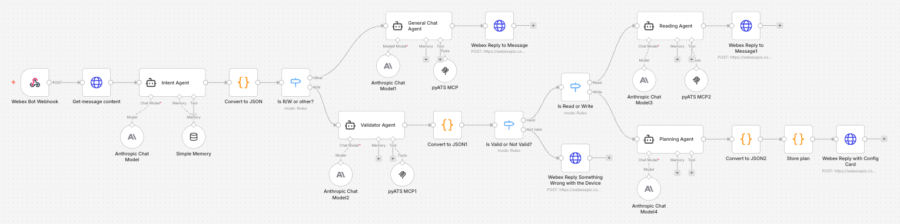
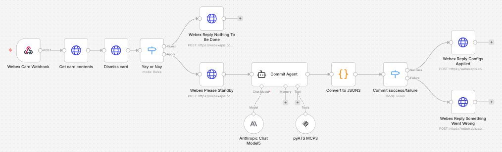

# ⚙️ ChatOps Agentic Network Automation Workflow (n8n + Webex Teams)

<div align="center">


</div>

A practical **low-code, agentic ChatOps workflow** built in **n8n** for safe network automation via **Webex Teams**.  
Uses **multiple specialized agents**, structured guardrails, and real device interaction through **pyATS MCP**.

[🔗 Link to n8n workflow file](https://github.com/ponchotitlan/pyATS-loves-agenticops/blob/main/workflows/(WxT)%20ChatOps%20Network%20Automation%20Workflow.json)

---

## ✨ What this gives you

- 💬 Operate your network from Webex Teams (ChatOps)
- 🧠 Agentic architecture (separation of responsibilities)
- 🕵️ Device validation gate before any execution
- 🛡️ Guardrails for risky operations
- 👤 Human approval via Webex Adaptive Cards before changes
- 🔁 Rollback-aware execution
- 🌐 Publicly reachable webhooks via Cloudflare Tunnel (required by Webex)
- 🧩 Fully self-hosted (n8n + Anthropic Claude + MCP)

---

## 🧠 Architecture at a glance

| Agent | Responsibility | Can Execute Writes? |
|------|----------------|----------------------|
| Intent Agent | Classifies `read` vs `write` vs `other`, extracts structured JSON | ❌ |
| General Chat Agent | Handles general queries and device inventory via MCP | ❌ |
| Validator Agent | Checks device existence and reachability via MCP | ❌ |
| Reading Agent | Executes operational queries via **pyATS MCP** | ❌ (read-only) |
| Planning Agent | Generates CLI plan, risk level, rollback | ❌ |
| Commit Agent | Pushes approved configs via **pyATS MCP** | ✅ (after approval) |

This separation ensures **no single agent has full power**.

---

## 🔐 Safety & Guardrails

Built-in by design:

- Strict intent classification (`read` vs `write` vs `other`)
- Dedicated **Validator Agent** confirms device existence and reachability before any execution path
- Structured JSON contracts between agents
- No configuration executed without:
  - Device validation pass
  - Generated plan
  - Risk level
  - Rollback commands
  - Explicit Webex Adaptive Card button confirmation
- Read and Write execution handled by different agents

Result: **predictable, inspectable, auditable automation**.

---

## 🔄 End-to-end flow

1. User mentions the bot in a Webex Teams space  
2. Webex Bot Webhook receives the event; full message content is fetched via the Webex API  
3. Intent Agent classifies the request and extracts a structured JSON payload  
4. Switch by intent:
   - `other` → General Chat Agent handles general questions or inventory requests → reply in Webex thread
   - `read` / `write` → Validator Agent checks every target device via **pyATS MCP**
5. If any device is invalid or unreachable → error reply posted to Webex thread
6. If all devices are valid:
   - `read` → Reading Agent → **pyATS MCP executes show commands** → formatted reply in Webex thread
   - `write` → Planning Agent → Adaptive Card with plan, risk level, and rollback commands posted to Webex
7. User clicks the button on the card:
   - ❌ Cancel → card is dismissed, "nothing to be done" reply posted
   - ✅ Confirm → "please standby" reply posted → Commit Agent → **pyATS MCP pushes configuration**
8. Result (success or failure) posted back to the same Webex thread

---

## 🌐 Public endpoint options

Webex Teams webhooks require a **publicly reachable HTTPS endpoint**. This project includes two Docker Compose examples for that:

- `docker-compose-example-cloudflare.yml` for a Cloudflare Tunnel bound to your own domain
- `docker-compose-example-ngrok.yml` for an ngrok tunnel using a reserved static domain

The Cloudflare flow looks like this:

```
n8n.yourdomain.com  →  Cloudflare Tunnel  →  n8n (container, port 5678)
```

- No port forwarding or VPN required
- TLS termination handled by Cloudflare
- n8n is configured with `WEBHOOK_URL`, `N8N_HOST`, and `N8N_EDITOR_BASE_URL` pointing to the domain, so all webhook URLs it generates are correct and reachable by Webex
- `N8N_PROXY_HOPS=1` ensures n8n correctly resolves the real client IP behind the tunnel

If you prefer ngrok, use a reserved domain and configure the matching placeholders in `docker-compose-example-ngrok.yml`.

---

## 🔌 pyATS MCP integration

Three agents rely on an external **[MCP server backed by pyATS](https://github.com/ponchotitlan/pyATS_MCP)**:

- Validator Agent → uses MCP to confirm device inventory and reachability  
- Reading Agent → uses MCP to run operational commands safely  
- Commit Agent → uses MCP to apply approved configurations  

MCP server implementation used here:  
👉 https://github.com/ponchotitlan/pyATS_MCP

This cleanly separates:
- 🧠 Reasoning (agents)
- 🔧 Execution (pyATS tooling)

---

## 🧰 Core stack

- **n8n** – workflow orchestration  
- **Webex Teams** – ChatOps interface (bot mentions + Adaptive Cards)  
- **Anthropic Claude Sonnet 4.5** – agent runtime  
- **Cloudflare Tunnel** – public HTTPS endpoint for Webex webhooks  
- **[pyATS MCP](https://github.com/ponchotitlan/pyATS_MCP)** – real network execution layer  
- **LangChain (via n8n nodes)** – agent abstraction  

---

## 🏗️ Use cases

- Internal NetOps automation platforms  
- Secure ChatOps bots on Webex Teams  
- Agentic system experimentation  
- Self-hosted AI infra for operations  

---

## 🚀 Setup (high level)

You'll need:

- n8n (self-hosted via Docker)
- A custom domain managed in Cloudflare (for the tunnel)
- Cloudflare Tunnel token from [Zero Trust dashboard](https://dash.cloudflare.com/zero-trust/networks/tunnels)
- Webex Teams Bot token with webhooks registered for:
  - Bot mentions (`messages` resource, `created` event)
  - Adaptive Card actions (`attachmentActions` resource, `created` event)
- Anthropic API key (Claude Sonnet 4.5)
- [pyATS MCP server](https://github.com/ponchotitlan/pyATS_MCP) running in HTTP transport mode
- *(Optional)* Cisco Secure Access CA certificate — mount it as `cisco-ca.pem` if your environment performs TLS inspection

Then:
- Pick one Docker Compose example and copy it to `docker-compose.yml`
- Configure the tunnel-specific settings for your chosen option
- Configure the shared pyATS MCP settings
- Import the workflow JSON into n8n
- Update credentials (Webex Bot token, Anthropic API key)
- Register both Webex webhooks pointing to your public n8n URL
- Adjust MCP endpoint URL if needed

### Cloudflare Docker Compose setup

Use `docker-compose-example-cloudflare.yml` when you want n8n exposed through a Cloudflare Tunnel.

- Copy `docker-compose-example-cloudflare.yml` to `docker-compose.yml`
- Replace `YOUR_DOMAIN` in these n8n settings with your public hostname, for example `n8n.example.com`:
  - `WEBHOOK_URL=https://YOUR_DOMAIN`
  - `N8N_HOST=YOUR_DOMAIN`
  - `N8N_EDITOR_BASE_URL=https://YOUR_DOMAIN`
- Replace `YOUR_TUNNEL_TOKEN` with the token from the Cloudflare Zero Trust dashboard

### ngrok Docker Compose setup

Use `docker-compose-example-ngrok.yml` when you want to expose n8n through ngrok.

- Copy `docker-compose-example-ngrok.yml` to `docker-compose.yml`
- Reserve a static ngrok domain in your ngrok dashboard
- Replace `YOUR-STATIC-DOMAIN` in these settings with that domain:
  - `WEBHOOK_URL=https://YOUR-STATIC-DOMAIN`
  - `N8N_HOST=YOUR-STATIC-DOMAIN`
  - `N8N_EDITOR_BASE_URL=https://YOUR-STATIC-DOMAIN`
  - `--domain=YOUR-STATIC-DOMAIN`
- Replace `YOUR-TOKEN` with your ngrok authtoken

### Shared pyATS MCP setup

Both Docker Compose examples already contain the same `pyats-mcp` service. Verify these shared settings:

- `MCP_TRANSPORT: http` keeps the MCP server in HTTP mode, which is what this workflow expects
- `MCP_HOST: 0.0.0.0` exposes the MCP server on all container interfaces
- `MCP_PORT: 8000` publishes the MCP API on port 8000 inside the Docker network and on the host
- `ports: - "8000:8000"` exposes the same MCP port on the host
- `./testbed.yaml:/app/testbed.yaml:ro` mounts your pyATS inventory file read-only into the container
- Replace `./testbed.yaml` with your own inventory file contents before starting the stack

If you need a different MCP port, change both `MCP_PORT` and the published port mapping together so they stay consistent.

---

## 📌 Philosophy

> Assume the model can be wrong. Design the system so mistakes are contained.

This workflow favors:
- Structure over clever prompts
- Multiple constrained agents over a single powerful one
- An explicit validation gate over trusting agent-reported device names
- Human approval over blind execution

---

If you're building serious agentic automation (not demos), this is meant to be a **solid foundation you can extend, audit, and trust**.
