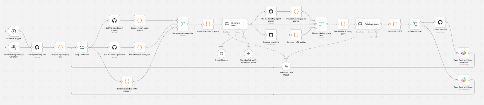
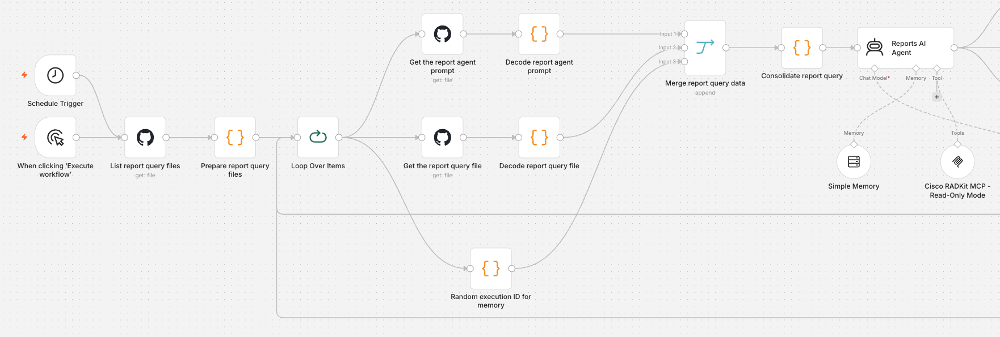
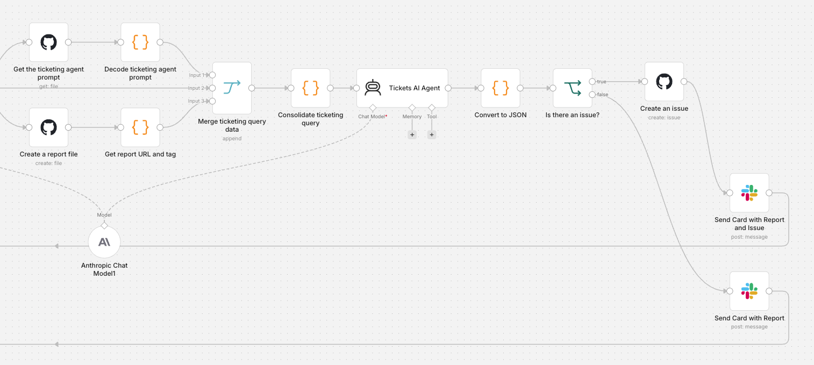

# 📊 Flujo de trabajo de reportes y ticketing automatizado para mi red

<div align="center">

</div>

Un **flujo de trabajo agentic de n8n** que automáticamente:

- 🧠 Investiga el estado de la red
- 📝 Genera reportes técnicos profesionales
- 📁 Guarda los reportes en GitHub
- 🎫 Detecta incidencias y crea tickets en GitHub con tareas accionables

Diseñado para **visibilidad operativa continua** y **reportes + creación de incidentes**.

---

## ✨ Qué te entrega

- 📅 Generación de reportes programada o manual
- 🤖 Investigación guiada por agentes usando datos reales de los equipos
- 📄 Reportes Markdown estructurados (guardados en GitHub)
- 🎫 Creación automática de incidencias cuando se detectan riesgos o recomendaciones
- 🔗 Trazabilidad completa entre reportes e incidentes
- 🧩 Totalmente auditable y compatible con GitOps

---

## 🧠 Arquitectura de un vistazo

| Agente | Responsabilidad | ¿Habla con la red? | ¿Crea tickets? |
|------|----------------|--------------------|------------------|
| Agente de reportes | Investiga, reúne datos y genera el reporte Markdown | ✅ mediante Cisco pyATS MCP (`herramientas de solo lectura`) | ❌ |
| Agente de tickets | Analiza el reporte, detecta incidencias y genera un issue de GitHub | ❌ | ✅ |

Separación clara de responsabilidades:  
> Un agente observa. El otro escala.

---
Primeras integraciones del agente



---
Segundas integraciones del agente



---

## 🔄 Flujo de punta a punta

1. El flujo se dispara:
   - ⏱️ Por programador
   - ▶️ O manualmente

2. El sistema carga dinámicamente desde GitHub (repositorio actual):
   - Todos los archivos de consulta de reportes bajo `n8n/Reportes y Auditoria para mi red/reports/*.txt`
   - Prompt del agente de reportes: `n8n/Reportes y Auditoria para mi red/agents/network_report_agent.txt`
   - Prompt del agente de tickets: `n8n/Reportes y Auditoria para mi red/agents/network_ticketing_agent.txt`
   - Las consultas se procesan una por una mediante `Loop Over Items`

3. **Agente de reportes**:
   - Usa **Cisco pyATS MCP** (`http://host.docker.internal:8000/mcp`) para consultar equipos
   - Se ejecuta con tu LLM y una clave de memoria de sesión por corrida
   - Produce un reporte Markdown estructurado con secciones como:
     - Resumen ejecutivo
     - Análisis y hallazgos
     - Riesgos y consideraciones
     - Recomendaciones

4. El reporte se guarda automáticamente en GitHub:
   - 📁 Carpeta destino: `n8n/Reportes y Auditoria para mi red/reports/files/`
   - Patrón de nombre: `<prefijo_de_archivo>_<timestamp>.md`

5. **Agente de tickets**:
   - Carga su prompt desde GitHub
   - Analiza el reporte generado
   - Convierte la salida del agente a JSON y valida `create_issue`
   - Si `create_issue = true`:
     - 🎫 Crea un issue de GitHub que incluye:
       - Prioridad
       - Resumen
       - Descripción detallada
       - Lista de tareas accionables
       - Enlace al reporte de origen
   - Si `create_issue = false`, no se crea ningún issue

6. Paso de notificación (Webex):
   - Envía una tarjeta adaptativa con el enlace al reporte en todos los casos
   - Incluye el enlace al issue cuando se crea uno

<div align="center"></br>
</br>
</br>
</br>
</div>

---

## 📂 Comportamiento impulsado por GitHub

Este flujo está diseñado intencionalmente para ser **Git-native**:

- Todos los prompts de los agentes se almacenan en GitHub
- Las solicitudes de reportes se almacenan en GitHub
- Los resultados (reportes) se guardan en GitHub
- Los hallazgos se convierten en issues de GitHub

Esto permite:
- Prompts versionados
- Definiciones de reportes revisables
- Trazabilidad completa
- Integración nativa con los flujos de trabajo de ingeniería

---

## 🏗️ Casos de uso

- Reportes continuos de postura de red
- Preparación para auditorías
- Generación de evidencia de cumplimiento
- Detección proactiva de riesgos
- Backlogs de remediación generados automáticamente
- Flujos NetOps con GitOps

---

## 🛠️ Configuración

### 1. Consigue un token de GitHub

Este flujo está configurado para guardar los reportes generados en el mismo repositorio de GitHub. Si prefieres guardarlos en el tuyo, sigue estos pasos:

1. Entra a www.github.com e inicia sesión con tus credenciales
2. Haz clic en tu avatar y ve a `Settings` -> `Developer Settings` -> `Personal Access Tokens` -> `Fine-grained tokens`
3. Crea un token nuevo. Agrega el repositorio que te interesa y los siguientes permisos:

```text
- Read access to artifact metadata and metadata
- Read and Write access to code and issues
```

### 2. Configuración de Slack
✅💬 Revisa [esta guía sin fricción](../../docs/SLACK-SETUP.md). Sigue solo los pasos *1 al 6*.

### 3. Levantar todo

Este repositorio contiene un [archivo de docker compose](../../docker-compose.yml) que levanta un contenedor para `n8n`, el servidor `Cisco pyATS MCP` y un túnel de Cloudflare que no necesitamos para este flujo.

Modifica el servicio `n8n` del archivo Docker Compose para quitar todas las referencias al túnel:

```yaml
n8n:
  # ... otra configuración ...
  environment:
    - TZ=Europe/Lisbon
    - GENERIC_TIMEZONE=Europe/Lisbon
    - N8N_USER_MANAGEMENT_DISABLED=true
    - EXECUTIONS_DATA_SAVE_ON_SUCCESS=all
    - EXECUTIONS_DATA_SAVE_ON_ERROR=all
    - EXECUTIONS_DATA_SAVE_MANUAL_EXECUTIONS=true
    - NODE_EXTRA_CA_CERTS=/home/node/cisco-ca.pem
    
    # Configuración simplificada solo para acceso local
    - N8N_HOST=0.0.0.0
    - N8N_LISTEN_ADDRESS=0.0.0.0
    - N8N_PORT=5678
    - N8N_PROTOCOL=http
    # Quita WEBHOOK_URL y N8N_EDITOR_BASE_URL para acceso solo local
    # Quita la configuración de CORS si no la necesitas
```

Finalmente, levanta solo los servicios de n8n y pyATS MCP:
```bash
docker compose up -d n8n pyats-mcp
```

Los siguientes servicios estarán disponibles en estas direcciones:

| Servicio | Endpoint |
|---|---|
| 🎯 n8n | `http://localhost:5678` |
| 🤖 Servidor pyATS MCP | `http://host.docker.internal:8000/mcp` |

### 4. Importación del workflow en n8n
1. Entra a tu instancia de n8n desde el navegador
2. Crea un workflow nuevo
3. Importa el archivo [Reporting_Auditing for my network.json](Reporting_Auditing%20for%20my%20network.json) incluido en este repositorio
4. En los nodos que usan GitHub y Slack, crea un nuevo conjunto de credenciales usando tu token de GitHub y tu token del bot de Slack

---

<div align="center"><br />
    Hecho con ☕️ por Poncho Sandoval - <code>Developer Advocate 🥑 @ DevNet - Cisco Systems 🇵🇹</code>
</div>
