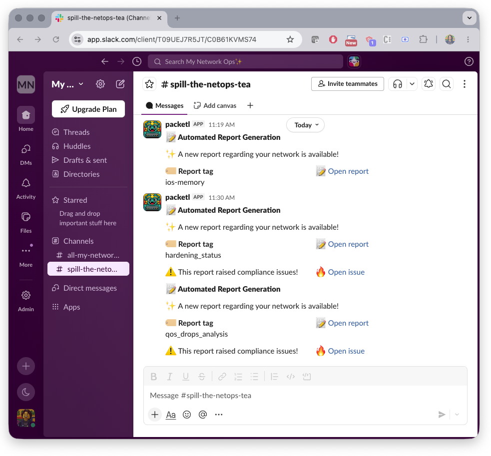
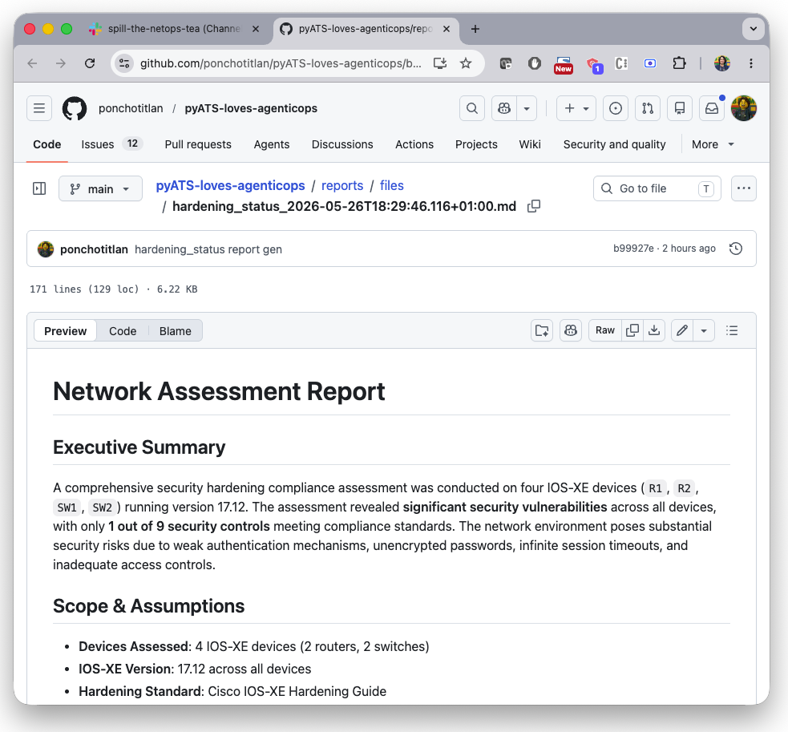
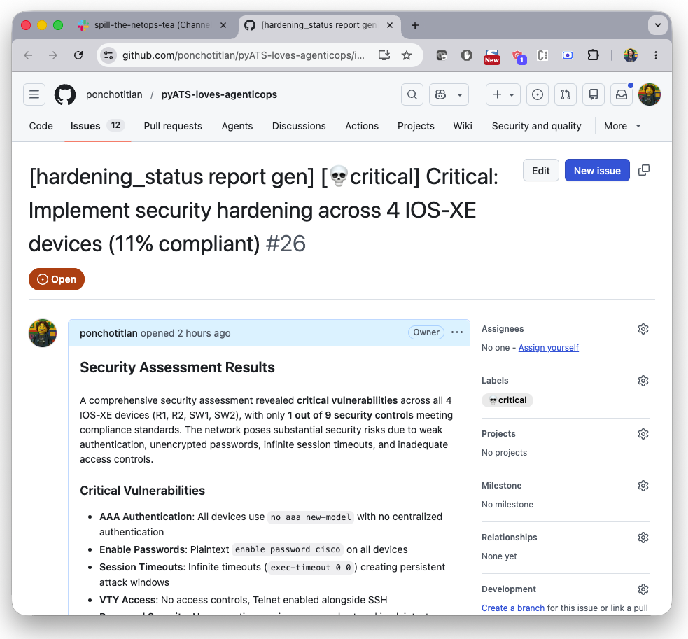

# 📊 Agentic Reporting & Automated Ticketing for my network Workflow

<div align="center">
<!--  -->
</div>

An **agentic n8n workflow** that automatically:

- 🧠 Investigates network state
- 📝 Generates professional technical reports
- 📁 Commits reports to GitHub
- 🎫 Detects issues and auto-creates GitHub tickets with actionable tasks

Designed for **continuous operational visibility** and **reporting + issue creation**.

---

## ✨ What this gives you

- 📅 Scheduled or manual report generation  
- 🤖 Agent-driven investigation using real device data  
- 📄 Structured Markdown reports (committed to GitHub)  
- 🎫 Automatic issue creation when risks/recommendations are detected  
- 🔗 Tight traceability between reports and tickets  
- 🧩 Fully auditable, GitOps-friendly workflow  

---

## 🧠 Architecture at a glance

| Agent | Responsibility | Talks to Network? | Creates Tickets? |
|------|----------------|--------------------|------------------|
| Reporting Agent | Investigates, gathers facts, renders Markdown report | ✅ via Cisco pyATS MCP (`read-only tools`) | ❌ |
| Ticketing Agent | Analyzes report, detects issues, generates GitHub issue | ❌ | ✅ |

Clean separation of concerns:  
> One agent observes. One agent escalates.

---

## 🔄 End-to-end flow

1. Workflow triggered:
   - ⏱️ By scheduler  
   - ▶️ Or manually  

2. System loads dynamically from GitHub (current repo):
   - All report query files under `n8n/Reporting and Auditing for my network/reports/*.txt`
   - Reporting agent prompt: `n8n/Reporting and Auditing for my network/agents/network_report_agent.txt`
   - Ticketing agent prompt: `n8n/Reporting and Auditing for my network/agents/network_ticketing_agent.txt`
   - Queries are processed one-by-one via `Loop Over Items`

3. **Reporting Agent**:
   - Uses **Cisco pyATS MCP** (`http://host.docker.internal:8000/mcp`) to query devices
   - Runs with your LLM + session memory key per execution
   - Produces a structured Markdown report with sections like:
     - Executive Summary  
     - Analysis & Findings  
     - Risks & Considerations  
     - Recommendations  

4. Report is automatically committed to GitHub:
   - 📁 Target folder: `n8n/Reporting and Auditing for my network/reports/files/`
   - Naming pattern: `<file_prefix>_<timestamp>.md`

5. **Ticketing Agent**:
   - Loads its prompt from GitHub  
   - Analyzes the generated report  
   - Converts agent output to JSON and checks `create_issue`
   - If `create_issue = true`:
     - 🎫 Creates a GitHub issue including:
       - Priority  
       - Summary  
       - Detailed description  
       - Actionable task list  
       - Link to the originating report
   - If `create_issue = false`, no issue is created

6. Notification step (Webex):
   - Sends an adaptive card with report link in all cases
   - Includes issue link when an issue is created

<div align="center"></br>
</br>
</br>
</br>
</div>

---

## 📂 GitHub-driven behavior

This workflow is intentionally **Git-native**:

- All agent prompts are stored in GitHub  
- Report requests are stored in GitHub  
- Outputs (reports) are committed to GitHub  
- Findings become GitHub Issues  

This enables:
- Versioned prompts  
- Reviewable report definitions  
- Full audit trail  
- Native integration with engineering workflows  

---

## 🏗️ Use cases

- Continuous network posture reporting  
- Audit preparation  
- Compliance evidence generation  
- Proactive risk detection  
- Auto-generated remediation backlogs  
- GitOps-driven NetOps workflows  

---

## 🛠️ Setup

### 1. Get a GitHub Token

This workflow is setup to save the reports generated in the same GitHub repository. For saving them in yours instead, follow these steps:

1. Navigate to www.github.com and login using your credentials
2. Click on your avatar and navigate to `Settings` -> `Developer Settings` -> `Personal Access Tokens` -> `Fine-grained tokens`
3. Create a new token. Add your repository of interest and the following permissions:

```text
- Read access to artifact metadata and metadata
- Read and Write access to code and issues
```

### 2. Slack Setup
✅💬 See [this frustration-free guide!](../../docs/SLACK-SETUP.md) - Follow steps *1 through 6** only.

### 3. Launching everything

This repository contains a [docker compose file](../../docker-compose.yml) that launches a container for `n8n`, the `Cisco pyATS MCP server`, and a Clouflare Tunnel that we don't need for this workflow. 

Modify the service `n8n` of the Docker Compose file to remove all references to the tunnel:

```yaml
n8n:
  # ... other config ...
  environment:
    - TZ=Europe/Lisbon
    - GENERIC_TIMEZONE=Europe/Lisbon
    - N8N_USER_MANAGEMENT_DISABLED=true
    - EXECUTIONS_DATA_SAVE_ON_SUCCESS=all
    - EXECUTIONS_DATA_SAVE_ON_ERROR=all
    - EXECUTIONS_DATA_SAVE_MANUAL_EXECUTIONS=true
    - NODE_EXTRA_CA_CERTS=/home/node/cisco-ca.pem
    
    # Simplified configuration for local access only
    - N8N_HOST=0.0.0.0
    - N8N_LISTEN_ADDRESS=0.0.0.0
    - N8N_PORT=5678
    - N8N_PROTOCOL=http
    # Remove WEBHOOK_URL and N8N_EDITOR_BASE_URL for local-only access
    # Remove CORS settings if not needed
```

Finally, start the n8n and pyATS MCP services only:
```bash
docker compose up -d n8n pyats-mcp
```

The following services will be available in these locations:

| Service | Endpoint |
|---|---|
| 🎯 n8n | `http://localhost:5678` |
| 🤖 pyATS MCP server | `http://host.docker.internal:8000/mcp` |

### 4. n8n workflow import
1. Navigate to your n8n instance on a web browser
2. Create a new workflow
3. Import the file [Reporting_Auditing for my network.json](Reporting_Auditing%20for%20my%20network.json) included in this repository
4. On the nodes referring to GitHub and Slack, create a new set of credentials using your GitHub Token and Slack bot Token

---

<div align="center"><br />
    Made with ☕️ by Poncho Sandoval - <code>Developer Advocate 🥑 @ DevNet - Cisco Systems 🇵🇹</code>
</div>
