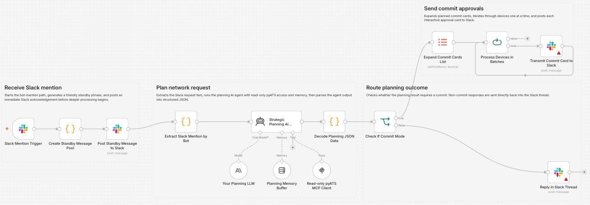
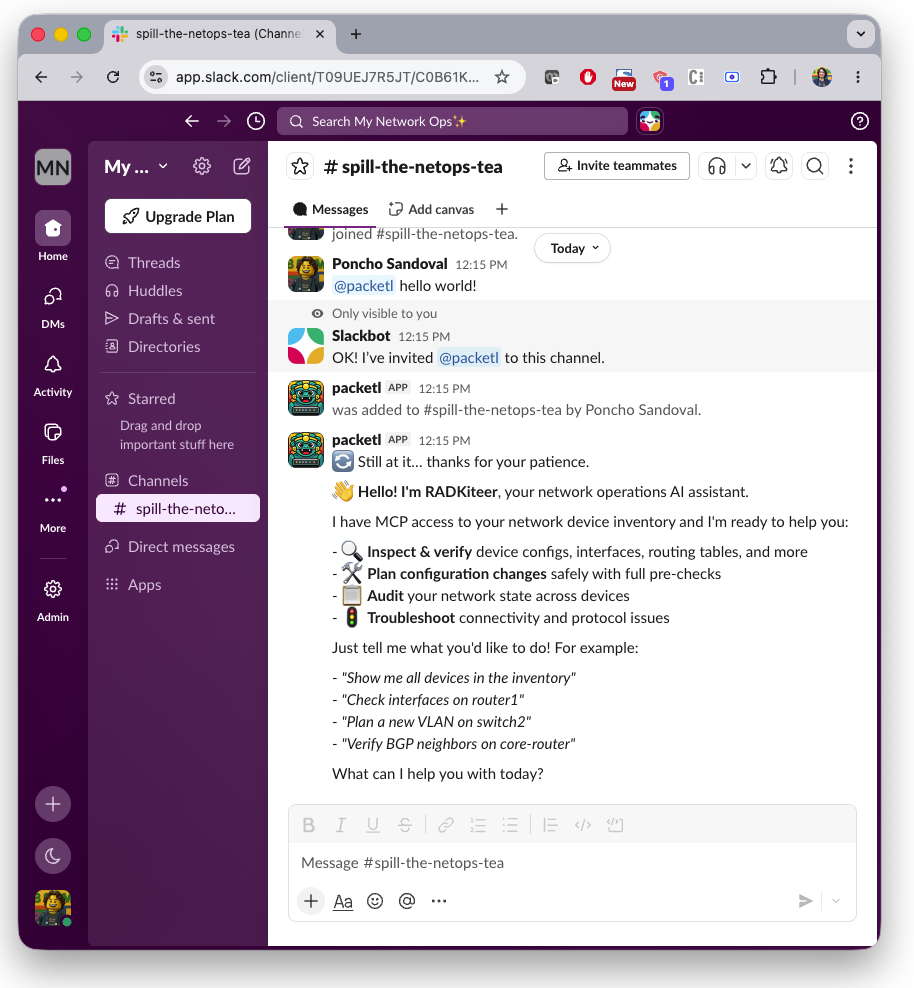
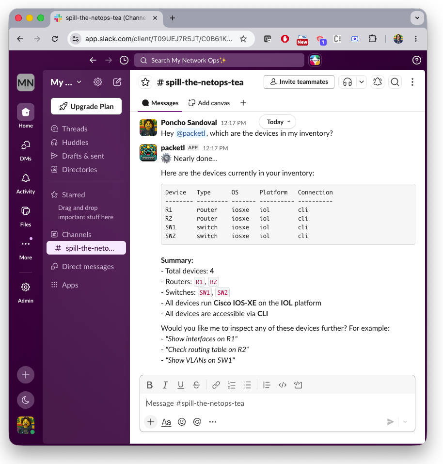
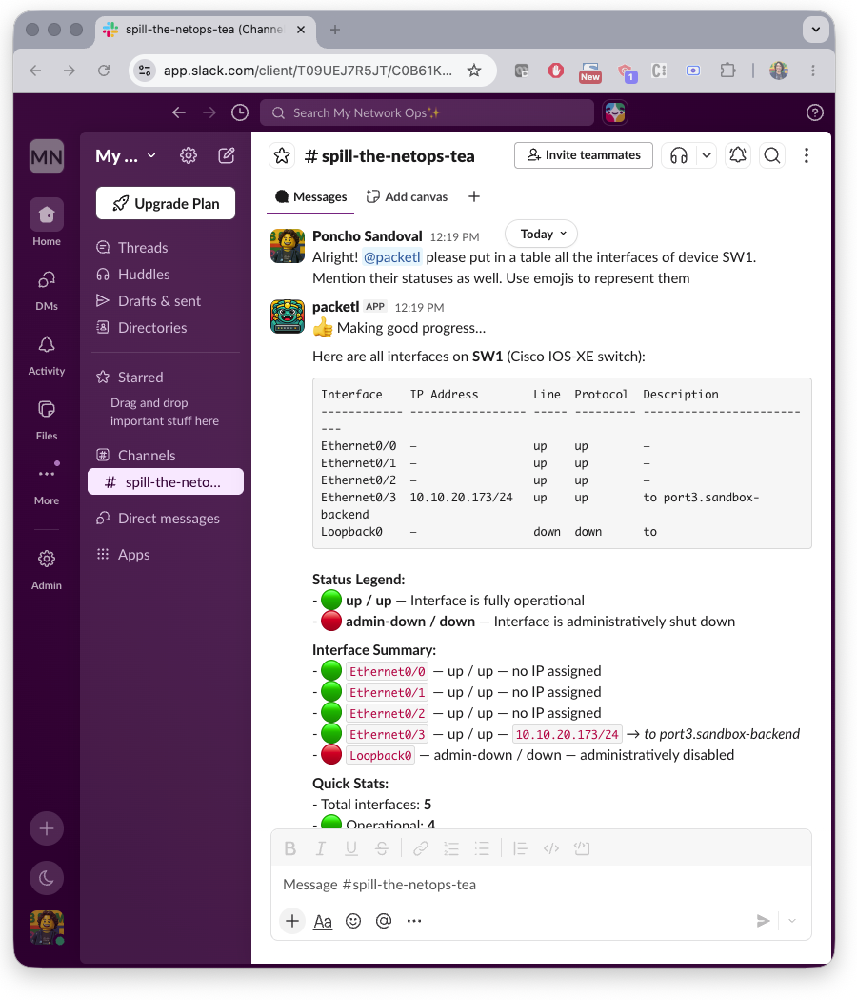
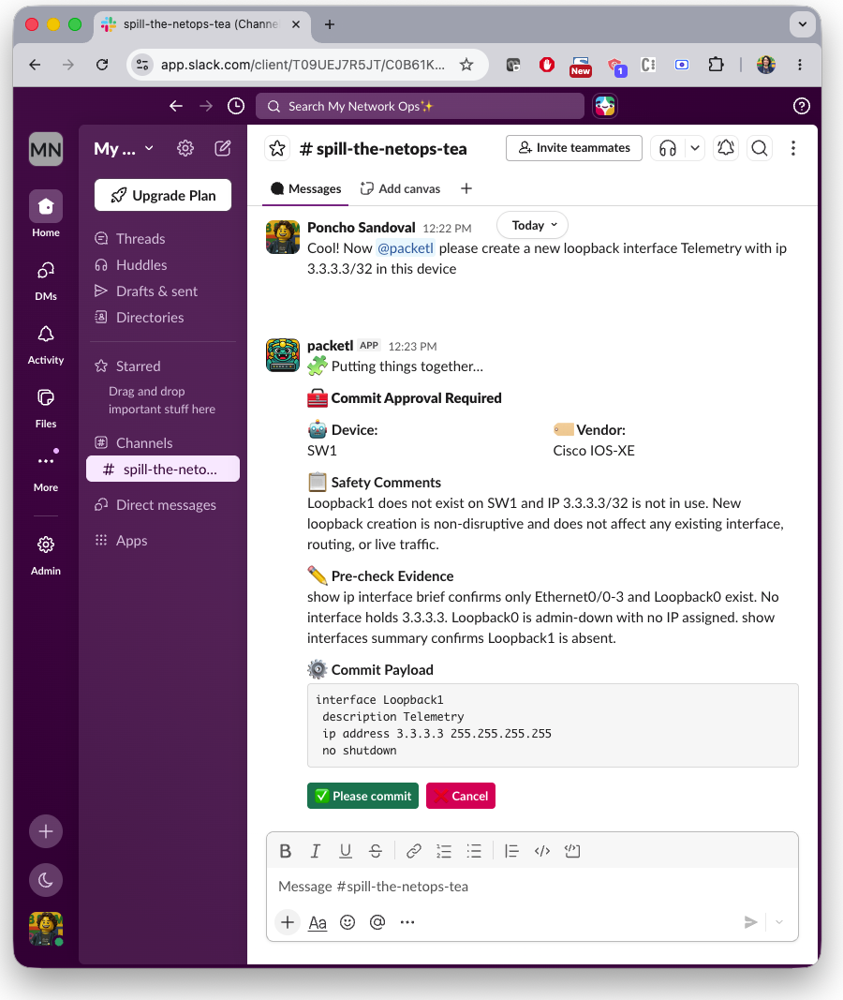
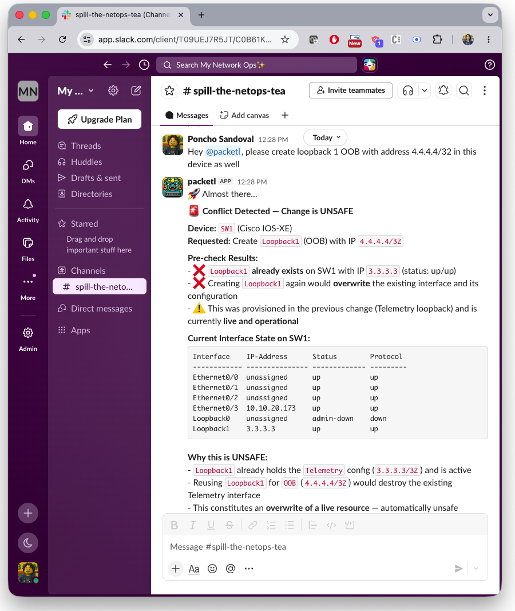
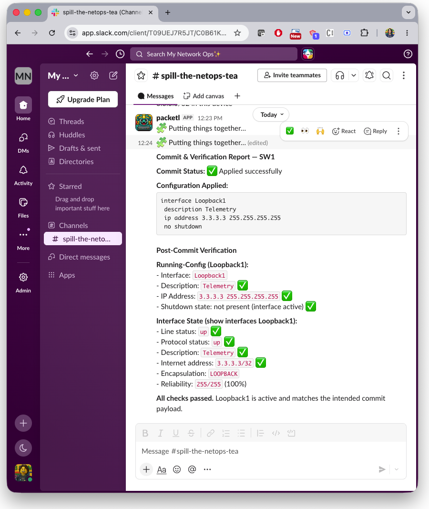
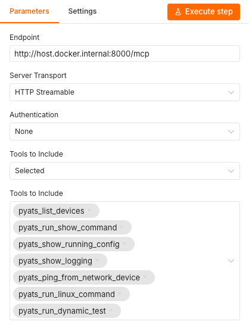

# ⚙️ Enhanced Slack ChatOps for my Network Workflow

<div align="center">

</div>

A practical **low-code, agentic ChatOps workflow** built in **n8n** for safe network automation via **Slack**.  
Uses **multiple specialized agents**, structured guardrails, and real device interaction through the **pyATS MCP server**.

---

## ✨ What this gives you

- 💬 Operate your network from Slack (ChatOps)
- 🧠 Agentic architecture (separation of responsibilities)
- 🕵️ Device validation gate before any execution
- 🛡️ Guardrails for risky operations
- 👤 Human approval via Slack interactive messages before changes
- 🔁 Rollback-aware execution
- 🌐 Publicly reachable webhooks via Cloudflare Tunnel (required by Slack)
- 🧩 Fully self-hosted (n8n + MCP)

---

## 🧠 Architecture at a glance

| Agent | Responsibility | Can Execute Writes? | MCP Mode |
|------|----------------|----------------------|----------|
| Planning AI Agent | Classifies `read` vs `commit`, generates plan + risk assessment | ❌ | Read-only |
| Commit And Verify AI Agent | Validates approved changes and applies configuration | ✅ (after user approval) | Full |

**Execution separation:**
- All **pre-approval logic** runs in read-only tools from the pyATS MCP server
- Only the **Commit Agent** accesses full MCP tools after Slack message confirmation
- Memory buffers maintain conversation context per thread/channel ID

This ensures **no single agent can execute changes without human approval**.

---

## 🔐 Safety & Guardrails

Built-in by design:

- **MCP tooling**: Read-only and full tooling enforce execution boundaries
- **Intent classification**: Structured JSON extraction (`read` vs `commit` intent)
- **Planning-only pre-approval**: All agents generate plans before any write operation
- **Memory-based session handling**: Per-thread context tracking with LangChain buffer window
- **No configuration executed without**:
  - Device validation pass
  - Generated plan with safety verdict
  - Risk assessment
  - Explicit Slack button confirmation from user
- **Button interaction validation**: Separate webhook for button actions ensures intent confirmation

Result: **predictable, inspectable, auditable automation with clear human-in-the-loop boundaries**.

---

## 🔄 End-to-end flow

1. User mentions the bot in a Slack channel
2. `When the bot is mentioned` webhook triggered: message content fetched via Slack API
3. "Please Standby" random phrase sent to user
4. Full message retrieved and passed to **Planning AI Agent**
5. Planning Agent classifies intent (`read` vs `commit`) via LLM + read-only tools from MCP
6. Planning Agent returns structured JSON: `{ mode, reply_markdown, cards[] }`
7. JSON transformation validates and normalizes response
8. Switch by mode:
   - `read` → reply posted to thread immediately (no interactive message)
   - `commit` → interactive message with plan, risk level, and action buttons posted to thread
9. User clicks button on message:
   - ❌ Cancel → card deleted, "cancelled" reply posted
   - ✅ Confirm → standby message posted, card deleted
10. **Commit And Verify AI Agent** executes via full MCP tools
11. Agent applies configuration, re-fetches state, verifies result
12. Verification markdown posted back to original thread

---

Upon adding the bot to the chat, you can ask it to introduce itself.
<div align="center"></br>
</br>
</div>

---

You can later ask about your inventory devices, for example.
<div align="center"></br>
</br>
</div>

---

When querying any specific configuration about any device in the inventory tagging the bot, the MCP server sends the request via pyATS and then displays the result in the chat.
<div align="center"></br>
</br>
</div>

---

Any commit intent results in a card for human-in-the-loop approval. The card will show up if and only if the configuration is deemed safe. The card will include justifications for why the commit is safe, taking into account freshly collected data from the target device.
<div align="center"></br>
</br>
</div>

---

On the other hand, if the configuration intent collides with anything existing, the agent will highlight this and explain.
<div align="center"></br>
</br>
</div>

---

When clicking Proceed, the commit is done and the agent collects evidence to verify if the configuration was successfully applied.
<div align="center"></br>
</br>
</div>

---

## 🏗️ Use cases

- Querying my network device inventory
- Fine-grained querying of device configurations and statuses
- Cross-check against intended configurations and states
- Housekeeping chores via guarded commits

---

## 🛠️ Setup

### 1. Your network testbed

The Cisco pyATS framework relies on a [testbed.yaml](../../testbed.yaml) file to connect to your network devices. This repository comes with a pre-populated file based on the devices available within the [Cisco Modeling Labs - Always-On Sandbox](https://devnetsandbox.cisco.com/DevNet/catalog/cml-sandbox_cml). You can adjust these values to connect to your own devices, always following this convention in the yaml file:

```yaml
---
devices:
  your-device-name:
    os: your-vendor
    type: your-type
    platform: your-platform
    credentials:
      default:
        username: your-username
        password: your-password
    connections:
      cli:
        protocol: ssh/telnet
        ip: your-address
```

The full list of options is available [in this link](https://developer.cisco.com/docs/pyats/api/pyats-documentation-pyats-documentation/) -> `Testbed & Topology Information` -> ` Topology Schema`.

### 2. Cloudflare Tunnel

Slack webhooks require a **publicly reachable HTTPS endpoint**. This project includes a Docker Compose service for Cloudflare tunnel
The Cloudflare flow looks like this:

```
n8n.yourdomain.com  →  Cloudflare Tunnel  →  n8n (container, port 5678)
```

You can either opt for this option, or use any other solution such as `ngrok`. However, this reppsitory uses the custom repository and tunnel token provided by Cloudflare. To set them up before launching the workflow, create a `.env` file and populate the following information:

```text
CLOUDFLARE_TUNNEL_TOKEN=your-cloudflare-tunnel-token
N8N_PUBLIC_URL=https://n8n.your-domain.example
```

### 3. Build and start
Start all the docker compose services with the following command:

```bash
docker compose up --build -d
```

If you want to start only specific services, use the table below:

| Service | Command | What to adjust before running | Available at (URL:port) |
|---|---|---|---|
| n8n | `docker compose up -d n8n` | In `.env`, set `N8N_PUBLIC_URL` to your public HTTPS URL (used by webhook and editor base URLs) | `http://localhost:5678` |
| pyats-mcp | `docker compose up -d pyats-mcp` | Update `testbed.yaml` with your device inventory, credentials, and management IPs. If you need a different port, change `MCP_PORT` and published port mapping in `docker-compose.yml`. | `http://localhost:8000/mcp` |
| cloudflare-tunnel | `docker compose up -d cloudflare-tunnel` | In `.env`, set `CLOUDFLARE_TUNNEL_TOKEN`. Ensure `N8N_PUBLIC_URL` matches the hostname routed through your Cloudflare Tunnel. | No local HTTP endpoint. It exposes your public n8n URL (for example `https://n8n.your-domain.example`). |

> If you already have a n8n server of your own running, you just need to start the `pyats-mcp` service, and the `cloudflare-tunnel` in case your n8n instance is not available in the cloud for the Slack webhooks.

### 4. Import the workflow into n8n
Open n8n in your browser using the address provided in `N8N_PUBLIC_URL` or your own instance address. Create a new workflow and import [this JSON file](Multi-Agent%20Network%20ChatOps%20Assistant%20with%20Slack.json).

### 5. Setup the MCP nodes
Click on each of the two MCP nodes entitled `pyATS MCP` and provide the address of your MCP server container in the `Endpoint` field.

> If it is not in the same Docker network, remember to use an address of this sorts: `http://host.docker.internal:8000/mcp`

Now, in the specific MCP node `pyATS MCP - Read-only Mode`, add read-only guardrails by selecting the following tools in the `Tools to Include` part:
- `pyats_list_devices`
- `pyats_run_show_command`
- `pyats_show_running_config`
- `pyats_show_logging`
- `pyats_ping_from_network_device`
- `pyats_run_linux_command`
- `pyats_run_dynamic_test`

<div align="center"></br>
</br>
</div>

### 6. Slack Setup
This one takes a bit more effort, but you've got this! Check [this frustration-free guide.](../../docs/SLACK-SETUP.md)

---

<div align="center"><br />
    Made with ☕️ by Poncho Sandoval - <code>Developer Advocate 🥑 @ DevNet - Cisco Systems 🇵🇹</code>
</div>
