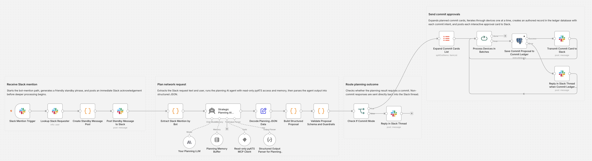
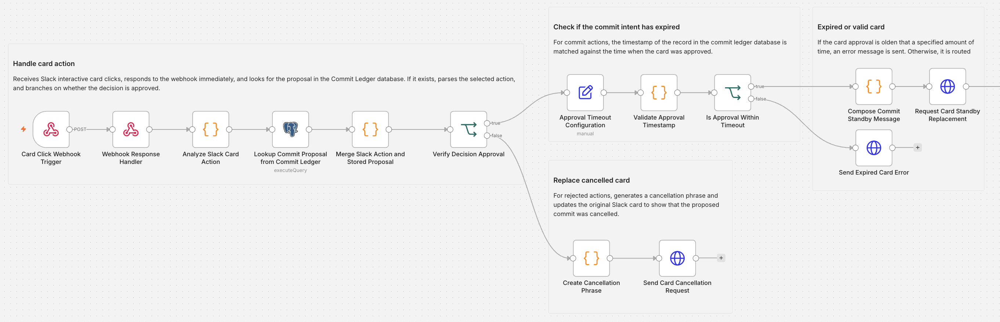
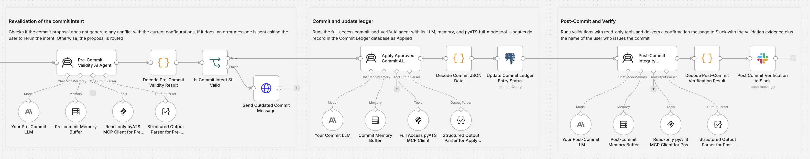
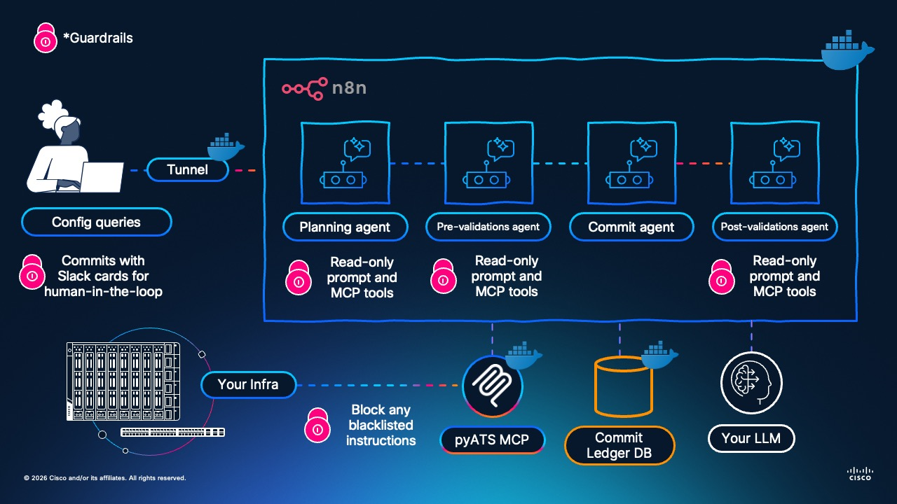
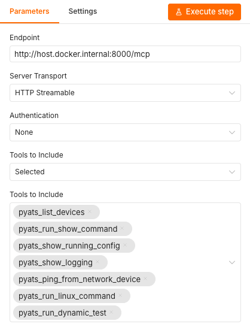

# ⚙️ Enhanced Slack ChatOps for my Network Workflow

<div align="center">



</div>

A practical **low-code, agentic ChatOps workflow** built in **n8n** for safe network automation through **Slack**.
It uses specialized AI agents, read-only checks, human approval, and a PostgreSQL **commit proposals ledger** before changing a device through the **pyATS MCP server**.

---

<div align="center">
<p><strong>📑 <a href="https://drive.google.com/file/d/18rhfyNeRthqgEozH3UUWnRbK-3gwNiiR/view?usp=sharing">Click here to view the AIConnect 2026 session slides: "Your Infrastructure is Not a Playground: AI Agents for Infra Done Right"</a></strong></p>
</div>

---

# [👉 Download the workflow at n8n.io/workflows 👈](https://n8n.io/workflows/16934-triage-network-read-and-commit-requests-via-slack-with-anthropic-and-pyats/)

## ✨ What this gives you

- 💬 Operate your network from Slack (ChatOps)
- 🧠 Agentic architecture (separation of responsibilities)
- 🕵️ Device validation gate before any execution
- 🛡️ Guardrails for risky operations
- 👤 Human approval via Slack interactive messages before changes
- 🔁 Revalidation before execution and verification after execution
- 🌐 Publicly reachable webhooks via Cloudflare Tunnel (required by Slack)
- 🧩 Fully self-hosted (n8n, pyATS MCP, and PostgreSQL)

---

## 🧠 Architecture at a glance

<div align="center">

</div>

| Agent | Responsibility | Can Execute Writes? | MCP Mode |
|------|----------------|----------------------|----------|
| Strategic Planning AI Agent | Classifies the request, gathers fresh data, assesses risk, and creates a read response or commit proposal | ❌ | Read-only |
| Pre-Commit Validity AI Agent | Re-checks the approved proposal against the current device state | ❌ | Read-only |
| Apply Approved Commit AI Agent | Applies only the approved payload after all checks pass | ✅ | Full access |
| Post-Commit Integrity Verification AI Agent | Re-fetches device state and verifies the result | ❌ | Read-only |

**Execution separation:**
- Planning, approval-time revalidation, and post-commit verification use read-only pyATS tools.
- The Apply Agent is the only agent with full MCP access, and it runs only after a valid Slack approval.
- PostgreSQL stores each proposal and its approval data so the workflow can look it up safely when a Slack button is clicked.

This keeps planning, approval, execution, and verification separate and auditable.

---

## 🔐 Safety & Guardrails

Built-in by design:

- **MCP tooling**: Read-only and full tooling enforce execution boundaries
- **Intent classification**: Structured JSON extraction (`read` vs `commit` intent)
- **Planning-only pre-approval**: The planning agent never writes to devices.
- **Commit proposals ledger**: PostgreSQL stores the proposal ID, requester, Slack thread, target device, payload, safety evidence, status, and expiry time.
- **Approval expiry**: A click is accepted only while the stored proposal is valid and within the configured approval timeout.
- **Revalidation**: The current device state is checked again immediately before the change.
- **Post-commit verification**: The result is checked with read-only tools and reported back to Slack.
- **No configuration executed without**:
  - Device validation pass
  - Generated plan with safety verdict
  - Risk assessment
  - Explicit Slack button confirmation from user
- **Button interaction validation**: A separate webhook reads the proposal from PostgreSQL and validates the selected action.

---

## 🔄 End-to-end flow

1. A user mentions the bot in Slack.
2. The workflow looks up the requester and posts a standby message.
3. The **Strategic Planning AI Agent** receives the request and uses read-only pyATS tools to identify devices, collect fresh evidence, classify the intent, and assess safety.
4. The response is parsed and validated as structured JSON.
5. For `read` requests, the findings are posted directly to the Slack thread.
6. For safe `commit` requests, the workflow creates one proposal per device, assigns each a `proposal_id` and expiry time, and saves it in the PostgreSQL commit ledger.
7. An interactive Slack approval card is posted for each saved proposal.
8. When a button is clicked, a separate Slack webhook:
  - looks up the proposal by `proposal_id`;
  - checks the action and approval timestamp;
  - replaces the card with a cancellation message; or
  - continues only with a fresh approval.
9. The **Pre-Commit Validity AI Agent** uses read-only tools to check for state drift, conflicts, dependencies, and syntax problems.
10. If the proposal is still valid, the **Apply Approved Commit AI Agent** applies only the stored payload through the full-access MCP client.
11. The **Post-Commit Integrity Verification AI Agent** re-fetches the device state and reports `verified`, `failed`, or `inconclusive` evidence.
12. The ledger is updated with the outcome and the verification result is posted to the original Slack thread.

---

🧭 Explore read-only network queries and device hardening compliance checks using the official [Cisco IOS XE Hardening Guide](https://sec.cloudapps.cisco.com/security/center/resources/IOS_XE_hardening).

<div align="center">
<p><strong>▶ Click the image below to watch the demo on YouTube</strong></p>

<a href="https://www.youtube.com/watch?v=ySa3fOKsTd0">

</a>
</div>

---

🛡️ See how the workflow checks the current device state and highlights configuration conflicts before presenting a change.

<div align="center">
<p><strong>▶ Click the image below to watch the demo on YouTube</strong></p>

<a href="https://www.youtube.com/watch?v=XQIhsC_4oz8">

</a>
</div>

---

👤 Watch the human-in-the-loop approval flow, including the Slack card, safety rationale, CLI payload, and database record.

<div align="center">
<p><strong>▶ Click the image below to watch the demo on YouTube</strong></p>

<a href="https://www.youtube.com/watch?v=7-Vxqk011yI">

</a>
</div>

---

✅ See how approved changes are checked for validity, applied to the target device, and verified afterward in Slack.

<div align="center">
<p><strong>▶ Click the image below to watch the demo on YouTube</strong></p>

<a href="https://www.youtube.com/watch?v=I-SiX7vRlGI">

</a>
</div>

---

⏳ See how expired or invalid commit proposals are rejected and reported in Slack.

<div align="center">
<p><strong>▶ Click the image below to watch the demo on YouTube</strong></p>

<a href="https://www.youtube.com/watch?v=kNZmAXuIYfA">

</a>
</div>


---

## 🛠️ Setup

### 1. Your network testbed

The Cisco pyATS framework relies on a [testbed.yaml](../../testbed.yaml) file to connect to your network devices. This repository comes with a pre-populated file based on the devices available within the [Cisco Modeling Labs - Always-On Sandbox](https://devnetsandbox.cisco.com/DevNet/catalog/cml-sandbox_cml). You can adjust these values to connect to your own devices, always following this convention in the yaml file:

```yaml
---
devices:
  your-device-name:
    os: your-vendor
    type: your-type
    platform: your-platform
    credentials:
      default:
        username: your-username
        password: your-password
    connections:
      cli:
        protocol: ssh/telnet
        ip: your-address
```

The full list of options is available [in this link](https://developer.cisco.com/docs/pyats/api/pyats-documentation-pyats-documentation/) -> `Testbed & Topology Information` -> ` Topology Schema`.

### 2. Environment variables

Create a `.env` file in the repository root. Use strong, private values for the database credentials:

```text
CLOUDFLARE_TUNNEL_TOKEN=your-cloudflare-tunnel-token
N8N_PUBLIC_URL=https://n8n.your-domain.example
COMMIT_LEDGER_USER=your-database-user
COMMIT_LEDGER_PASSWORD=your-database-password
COMMIT_LEDGER_NAME=commit_ledger
```

`N8N_PUBLIC_URL` must be the public HTTPS URL that Slack can reach. The PostgreSQL service uses the three `COMMIT_LEDGER_*` values to create the commit ledger database.

### 3. Cloudflare Tunnel

Slack webhooks require a **publicly reachable HTTPS endpoint**. This project includes a Docker Compose service for Cloudflare Tunnel.
The Cloudflare flow looks like this:

```
n8n.yourdomain.com  →  Cloudflare Tunnel  →  n8n (container, port 5678)
```

You can use another tunneling solution, such as `ngrok`, but Slack still needs a public HTTPS endpoint and the n8n URL must match it.

### 4. Build and start
Start all the docker compose services with the following command:

```bash
docker compose up --build -d
```

If you want to start only specific services, use the table below:

| Service | Command | What to adjust before running | Available at (URL:port) |
|---|---|---|---|
| n8n | `docker compose up -d n8n` | In `.env`, set `N8N_PUBLIC_URL` to your public HTTPS URL (used by webhook and editor base URLs) | `http://localhost:5678` |
| pyats-mcp | `docker compose up -d pyats-mcp` | Update `testbed.yaml` with your device inventory, credentials, and management IPs. If you need a different port, change `MCP_PORT` and published port mapping in `docker-compose.yml`. | `http://localhost:8000/mcp` |
| cloudflare-tunnel | `docker compose up -d cloudflare-tunnel` | In `.env`, set `CLOUDFLARE_TUNNEL_TOKEN`. Ensure `N8N_PUBLIC_URL` matches the hostname routed through your Cloudflare Tunnel. | No local HTTP endpoint. It exposes your public n8n URL (for example `https://n8n.your-domain.example`). |
| commit-ledger | `docker compose up -d commit-ledger` | Set `COMMIT_LEDGER_USER`, `COMMIT_LEDGER_PASSWORD`, and `COMMIT_LEDGER_NAME` in `.env`. The schema is created automatically from `db/init.sql`. | `localhost:5432` (local access only) |

> The n8n workflow needs access to both `pyats-mcp` and `commit-ledger`. If you use an existing n8n server, configure credentials and network access for both services.

### 5. Import the workflow into n8n
Open n8n in your browser using the address provided in `N8N_PUBLIC_URL` or your own instance address. Create a new workflow and import [this JSON file](Multi-Agent%20Network%20ChatOps%20Assistant%20with%20Slack.json).

### 6. Set up the MCP nodes
The workflow contains four MCP tool nodes: one full-access client for applying approved changes and three read-only clients for planning, pre-commit checks, and post-commit verification. Set the `Endpoint` field on each node to your pyATS MCP server URL.

> If it is not in the same Docker network, remember to use an address of this sorts: `http://host.docker.internal:8000/mcp`

For each read-only MCP node, select only these tools in `Tools to Include`:
- `pyats_list_devices`
- `pyats_run_show_command`
- `pyats_show_running_config`
- `pyats_show_logging`
- `pyats_ping_from_network_device`
- `pyats_run_linux_command`
- `pyats_run_dynamic_test`

<div align="center"></br>
</br>
</div>

The `Full Access pyATS MCP Client` must include the tools required by the Apply Agent, including the write-capable tools exposed by your pyATS MCP server. Keep this client connected only to the Apply Agent.

### 7. Slack setup
Follow the [Slack setup guide](../../docs/SLACK-SETUP.md). Configure both:

- the Slack Events URL for app mentions;
- the Slack Interactivity Request URL for approval-card button clicks.

The Interactivity URL must point to the workflow's `Card Click Webhook Trigger` endpoint.

---

<div align="center"><br />
    Made with ☕️ by Poncho Sandoval - <code>Developer Advocate 🥑 @ DevNet - Cisco Systems 🇵🇹</code>
</div>
